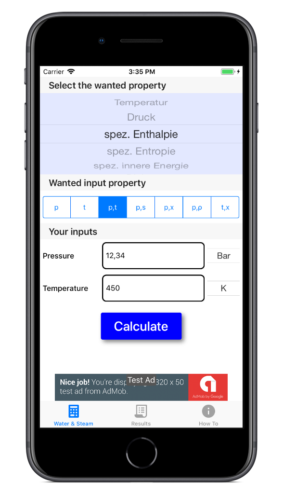

# [Water & Steam - Coming Soon](https://startbootstrap.com/template-overviews/coming-soon/)

**Water & Steam** is an easy-to-use implementation of [IAPWS IF-97](http://www.iapws.org/relguide/IF97-Rev.html) for mobile devices.

## Preview

## Status

## Download and Installation

This App is in development and not yet available. If you want to be informed by us once we have finished our app, then [Sign up with your email](https://maikksmt.github.io/water-steam/)

## Usage

The creation of the user guide is currently ongoing, but its use is intuitive and self-explanatory

## About

**Water & Steam** is created and maintained by **[Maik Kusmat](http://www.maik-kusmat.de)**.

* http://www.maik-kusmat.de
* https://twitter.com/maikkusmat
* https://github.com/maikksmt

## Copyright and License

Copyright 2018-2019 Maik Kusmat.
